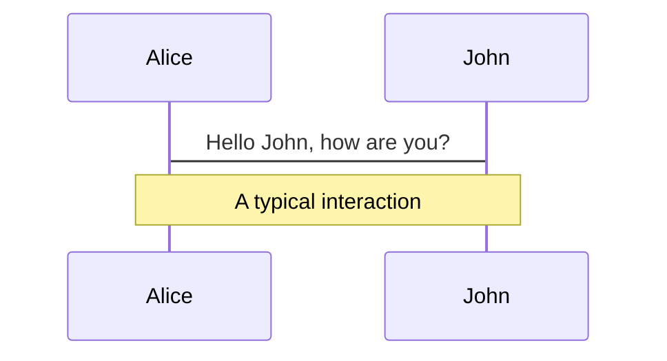
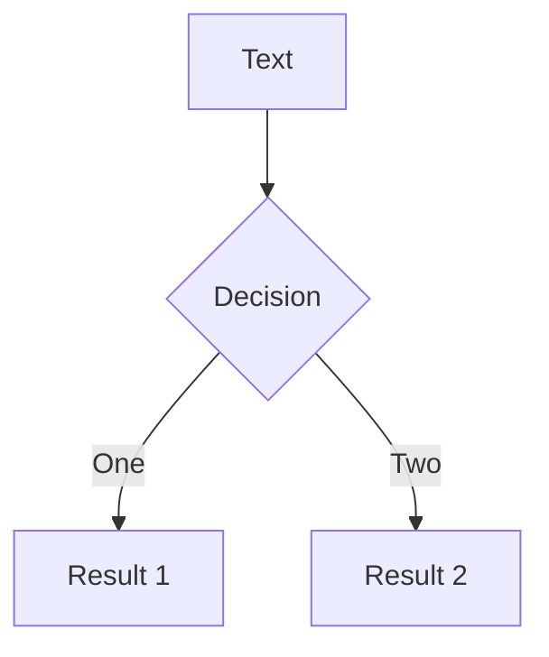
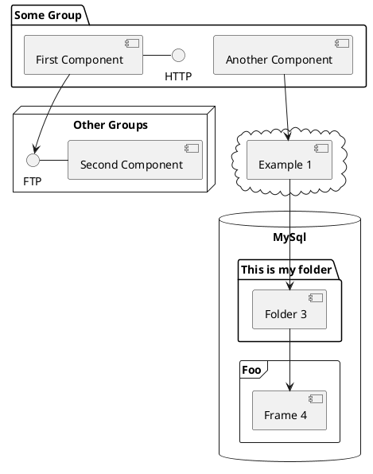

---
# try also 'default' to start simple
theme: seriph
# random image from a curated Unsplash collection by Anthony
# like them? see https://unsplash.com/collections/94734566/slidev
background: https://source.unsplash.com/collection/94734566/1920x1080
# apply any windi css classes to the current slide
class: 'text-center'
# https://sli.dev/custom/highlighters.html
highlighter: shiki
# show line numbers in code blocks
lineNumbers: false
# some information about the slides, markdown enabled
info: |
  ## An introduction to Tailwind CSS
  Presentation slides for developers.

  Learn more at [Tailwindcss.TW](https://tailwindcss.tw/)
# persist drawings in exports and build
drawings:
  persist: false
---

# Introduction to Tailwind CSS

My personal favorite design framework

<div class="pt-12">
  <span @click="$slidev.nav.next" class="px-2 py-1 rounded cursor-pointer" hover="bg-white bg-opacity-10">
    Press Space for next page <carbon:arrow-right class="inline"/>
  </span>
</div>

<div class="abs-br m-6 flex gap-2">
  <a href="https://github.com/slidevjs/slidev" target="_blank" alt="GitHub"
    class="text-xl icon-btn opacity-50 !border-none !hover:text-white">
    <carbon-logo-github />
  </a>
</div>

---

# What is Tailwind CSS?

TailwindCSS is a CSS framework for developers, consist of the following features

- 📝 **Utility-first** - CSS packed with classes that can be composed to build any design
- ⚡ **Performance** - Tiny, never ship unused CSS
- 📱 **Mobile-first** - Responsive everything
- 🌟 **State variants** - `hover` and `focus` states? Got ’em
- ⚛️ **Component-driven** - No need to be worried about duplication
- 🎨 **Themable** - Now with Dark Mode
- 🛠 **Customization** - Extend it, tweak it, change it

<br>
<br>

Read more about [Tailwind CSS?](https://tailwindcss.tw/)

---

# Navigation

Hover on the bottom-left corner to see the navigation's controls panel

### Keyboard Shortcuts

|                                                       |                             |
| ----------------------------------------------------- | --------------------------- |
| <kbd>right</kbd> / <kbd>space</kbd>                   | next animation or slide     |
| <kbd>left</kbd> / <kbd>shift</kbd> + <kbd>space</kbd> | previous animation or slide |
| <kbd>up</kbd>                                         | previous slide              |
| <kbd>down</kbd>                                       | next slide                  |


<p v-after class="absolute bottom-23 left-45 opacity-30 transform -rotate-10">Here!</p>

---

# Sizing

<div grid="~ cols-2 gap-4">
  <div>

```html
<div class="space-y-4">
  <div class="w-96 bg-white shadow rounded">w-96</div>
  <div class="w-80 bg-white shadow rounded">w-80</div>
  <div class="w-72 bg-white shadow rounded">w-72</div>
  <div class="w-64 bg-white shadow rounded">w-64</div>
  <div class="w-60 bg-white shadow rounded">w-60</div>
  <div class="w-56 bg-white shadow rounded">w-56</div>
  <div class="w-56 bg-white shadow rounded">w-52</div>
  <div class="w-56 bg-white shadow rounded">w-48</div>
</div>
```

</div>

<div>
  <Sizing />
</div>
</div>

<style>

</style>

---

# Colors

<div grid="~ cols-2 gap-4">
  <div>

```html
<div class="grid grid-cols-10 gap-2">
  <div class="bg-sky-50 aspect-square"></div>
  <div class="bg-sky-100 aspect-square"></div>
  <div class="bg-sky-200 aspect-square"></div>
  ...
  <div class="bg-sky-700 aspect-square"></div>
  <div class="bg-sky-800 aspect-square"></div>
  <div class="bg-sky-900 aspect-square"></div>
</div>

<div class="grid grid-cols-10 gap-2">
  <div class="bg-violet-50 aspect-square"></div>
  <div class="bg-violet-100 aspect-square"></div>
  <div class="bg-violet-200 aspect-square"></div>
  ...
  <div class="bg-violet-700 aspect-square"></div>
  <div class="bg-violet-800 aspect-square"></div>
  <div class="bg-violet-900 aspect-square"></div>
</div>
```

</div>

<div>
  <Colors />
</div>
</div>

<style>

</style>

---

# Shadows

<div grid="~ cols-2 gap-4">
  <div>

```html
<div class="grid grid-cols-10 gap-2">
  <div class="bg-sky-50 aspect-square"></div>
  <div class="bg-sky-100 aspect-square"></div>
  <div class="bg-sky-200 aspect-square"></div>
  ...
  <div class="bg-sky-700 aspect-square"></div>
  <div class="bg-sky-800 aspect-square"></div>
  <div class="bg-sky-900 aspect-square"></div>
</div>

<div class="grid grid-cols-10 gap-2">
  <div class="bg-violet-50 aspect-square"></div>
  <div class="bg-violet-100 aspect-square"></div>
  <div class="bg-violet-200 aspect-square"></div>
  ...
  <div class="bg-violet-700 aspect-square"></div>
  <div class="bg-violet-800 aspect-square"></div>
  <div class="bg-violet-900 aspect-square"></div>
</div>
```

</div>

<div>
  <Colors />
</div>
</div>

<style>

</style>

---

# Components

<div grid="~ cols-2 gap-4">
<div>

You can use Vue components directly inside your slides.

We have provided a few built-in components like `<Tweet/>` and `<Youtube/>` that you can use directly. And adding your custom components is also super easy.

```html
<Counter :count="10" />
```

<!-- ./components/Counter.vue -->
<Counter :count="10" m="t-4" />

Check out [the guides](https://sli.dev/builtin/components.html) for more.

</div>
<div>

```html
<Tweet id="1390115482657726468" />
```

<Tweet id="1390115482657726468" scale="0.65" />

</div>
</div>

---

## class: px-20

# Themes

Slidev comes with powerful theming support. Themes can provide styles, layouts, components, or even configurations for tools. Switching between themes by just **one edit** in your frontmatter:

<div grid="~ cols-2 gap-2" m="-t-2">

```yaml
---
theme: default
---
```

```yaml
---
theme: seriph
---
```


</div>

Read more about [How to use a theme](https://sli.dev/themes/use.html) and
check out the [Awesome Themes Gallery](https://sli.dev/themes/gallery.html).

---

## preload: false

# Animations

Animations are powered by [@vueuse/motion](https://motion.vueuse.org/).

```html
<div v-motion :initial="{ x: -80 }" :enter="{ x: 0 }">Slidev</div>
```

<div class="w-60 relative mt-6">
  <div class="relative w-40 h-40">
    
    
    
  </div>

  <div
    class="text-5xl absolute top-14 left-40 text-[#2B90B6] -z-1"
    v-motion
    :initial="{ x: -80, opacity: 0}"
    :enter="{ x: 0, opacity: 1, transition: { delay: 2000, duration: 1000 } }">
    Slidev
  </div>
</div>

<!-- vue script setup scripts can be directly used in markdown, and will only affects current page -->
<script setup lang="ts">
const final = {
  x: 0,
  y: 0,
  rotate: 0,
  scale: 1,
  transition: {
    type: 'spring',
    damping: 10,
    stiffness: 20,
    mass: 2
  }
}
</script>

<div
  v-motion
  :initial="{ x:35, y: 40, opacity: 0}"
  :enter="{ y: 0, opacity: 1, transition: { delay: 3500 } }">

[Learn More](https://sli.dev/guide/animations.html#motion)

</div>

---

# LaTeX

LaTeX is supported out-of-box powered by [KaTeX](https://katex.org/).

<br>

Inline $\sqrt{3x-1}+(1+x)^2$

Block

$$
\begin{array}{c}

\nabla \times \vec{\mathbf{B}} -\, \frac1c\, \frac{\partial\vec{\mathbf{E}}}{\partial t} &
= \frac{4\pi}{c}\vec{\mathbf{j}}    \nabla \cdot \vec{\mathbf{E}} & = 4 \pi \rho \\

\nabla \times \vec{\mathbf{E}}\, +\, \frac1c\, \frac{\partial\vec{\mathbf{B}}}{\partial t} & = \vec{\mathbf{0}} \\

\nabla \cdot \vec{\mathbf{B}} & = 0

\end{array}
$$

<br>

[Learn more](https://sli.dev/guide/syntax#latex)

---

# Diagrams

You can create diagrams / graphs from textual descriptions, directly in your Markdown.

<div class="grid grid-cols-3 gap-10 pt-4 -mb-6">







</div>

[Learn More](https://sli.dev/guide/syntax.html#diagrams)

---

layout: center
class: text-center

---

# Learn More

[Documentations](https://sli.dev) · [GitHub](https://github.com/slidevjs/slidev) · [Showcases](https://sli.dev/showcases.html)
